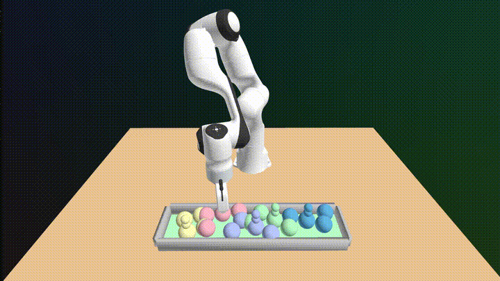
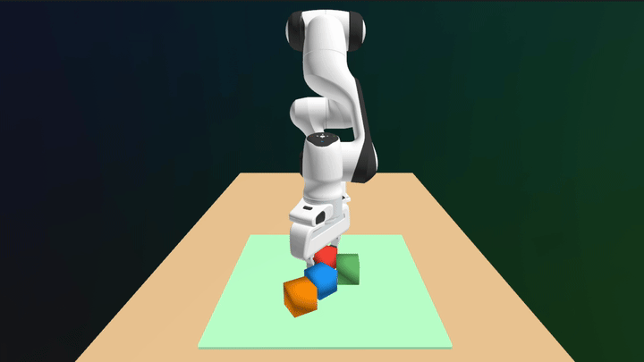
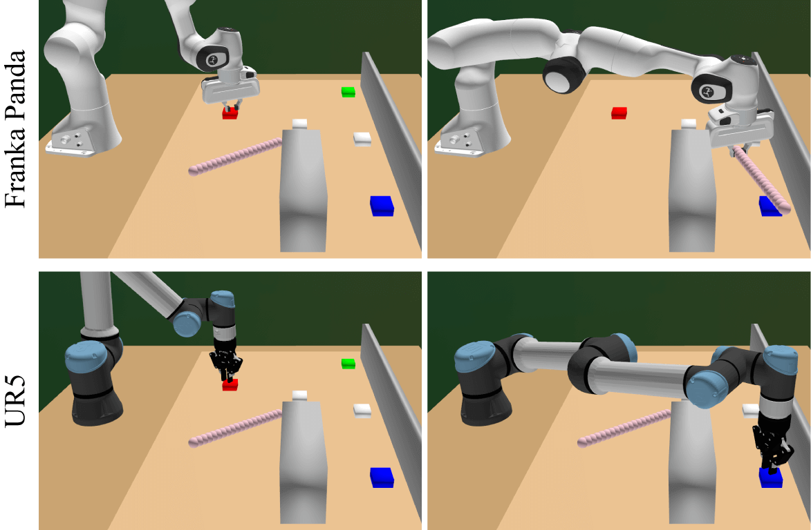

# cuTAMP: Differentiable GPU-Parallelized Task and Motion Planning

### [🌐 Project Website](https://cutamp.github.io) | [📝 Paper](https://arxiv.org/abs/2411.11833)

> **Differentiable GPU-Parallelized Task and Motion Planning**  
> [William Shen](https://shen.nz/)<sup>1,2</sup>,
> [Caelan Garrett](http://web.mit.edu/caelan/)<sup>2</sup>,
> [Nishanth Kumar](https://nishanthjkumar.com/)<sup>1,2</sup>,
> [Ankit Goyal](https://imankgoyal.github.io/)<sup>2</sup>,
> [Tucker Hermans](https://profiles.faculty.utah.edu/u6002596)<sup>2,3</sup>,  
> [Leslie Pack Kaelbling](https://people.csail.mit.edu/lpk/)<sup>1</sup>,
> [Tomás Lozano-Pérez](https://people.csail.mit.edu/tlp/)<sup>1</sup>,
> [Fabio Ramos](https://fabioramos.github.io/Home.html)<sup>2,4</sup>  
> <sup>1</sup>[MIT CSAIL](https://www.csail.mit.edu/),
> <sup>2</sup>[NVIDIA Research](https://www.nvidia.com/en-us/research/),
> <sup>3</sup>[University of Utah](https://www.utah.edu/),
> <sup>4</sup>[University of Sydney](https://www.sydney.edu.au/)  
> _Robotics: Science and Systems (**RSS**), 2025_

**Table of Contents:**

- [Installation](#installation)
- [Getting Started](#getting-started)
- [Examples](#examples)
    - [Tetris Packing](#tetris-packing)
    - [Optimizing Soft Costs](#optimizing-soft-costs)
    - [Searching over Plan Skeletons](#searching-over-plan-skeletons)
- [Troubleshooting](#troubleshooting)
- [Acknowledgements](#acknowledgements)
- [Citation](#citation)

## Installation

**Pre-Requisites:**

- cuTAMP depends on [cuRobo](https://curobo.org/), which has specific
  [hardware requirements](https://curobo.org/get_started/1_install_instructions.html#system-requirements)
- **GPU**: NVIDIA GPU with Volta or newer architecture
- **Python**: 3.10+ (we've only tested with Python 3.10)
- **PyTorch**: 2.0+ is recommended

### 1. Setup the Python environment

```bash
# We use conda, but feel free to use your favorite Python environment manager
conda create --name cutamp python=3.10 -y
conda activate cutamp
```

### 2. Install PyTorch

You **must** install a PyTorch version that is built for a CUDA version less than or equal to your CUDA Toolkit version.
This ensures that cuRobo compiles in the next step. To check your CUDA Toolkit version, run:

```bash
# Look for something like "release 12.6"
nvcc --version
```

If you don't have the CUDA Toolkit installed, install it via the official NVIDIA installer:
https://developer.nvidia.com/cuda-downloads

> ✅ Pick a version that's supported by your GPU drivers.  
> ⚠️ Don't overwrite your drivers unless you're sure, as it could cause issues with your system.

Then, install PyTorch using the command provided on the [PyTorch website](https://pytorch.org/get-started/locally/).
You can also install an [older version](https://pytorch.org/get-started/previous-versions/) of PyTorch if it better
matches your CUDA version:

```bash
# Example for latest PyTorch with CUDA 12.6
pip install torch torchvision torchaudio
```

### 3. Install cutamp

```bash
git clone https://github.com/NVlabs/cuTAMP.git
cd cuTAMP
pip install -e .
```

### 4. Install cuRobo

Before cloning cuRobo, make sure `git-lfs` is installed (used for pulling large assets).

```bash
sudo apt install git-lfs
git lfs install
```

Then clone and install cuRobo:

```bash
git clone https://github.com/NVlabs/curobo.git
cd curobo

# This can take up to 20 minutes to install
pip install -e . --no-build-isolation

# Optional: Verify that all unit tests pass
pip install pytest
python -m pytest .
cd ..
```

For full cuRobo installation instructions, see: https://curobo.org/get_started/1_install_instructions.html

## Getting Started

Once installed, you can run the default demo using:

```bash
cutamp-demo
```

This runs the [cutamp/scripts/run_cutamp.py](cutamp/scripts/run_cutamp.py) script with the default parameters on the
Tetris environment with 3 blocks. We use [Rerun](https://rerun.io/) to visualize the optimization and plan.

- If you're on a machine with a display, you're now good to go!
- If you're on a **remote or headless machine** (i.e., no display), see the instructions below on how to run with or
  without the visualizer.

Toggle between different [timelines](https://rerun.io/docs/reference/viewer/timeline) in the Rerun visualizer to see
different aspects of the optimization and planning. For a general guide on how to use Rerun, see
[this guide](https://rerun.io/docs/getting-started/navigating-the-viewer)

### Remote Visualization with Rerun

If you're running cuTAMP on a remote server without a display, you have two options:

1. Forward the Rerun visualizer port to your local machine via SSH (see below), or
2. Disable the visualizer using the `--disable_visualizer` flag:
    ```bash
    cutamp-demo --disable_visualizer
    ```

**Reverse Tunnel Setup**

1. On your **local machine** (e.g., laptop), install Rerun and start the viewer:
    ```bash
    pip install rerun-sdk
    rerun
    ```
   Note the TCP port shown in the top right of the viewer (usually `9876`).
   > 💡 Try to match the `rerun-sdk` version on your local and remote machines to avoid compatibility issues.  
   > You can check the version on the remote machine with: `pip show rerun-sdk`
2. Create a reverse SSH tunnel from your local machine to the remote server:
    ```bash
    ssh -R 9876:127.0.0.1:9876 username@server
    ```
3. On the **remote machine**, run the demo:
    ```bash
    cutamp-demo
    ```
   The visualizer will connect and stream to your local Rerun viewer through the tunnel!

## Examples

The `cutamp-demo` command runs the [`cutamp/scripts/run_cutamp.py`](cutamp/scripts/run_cutamp.py) script with a number
of useful options.

> ⚠️ This script exposes only a subset of the functionality of cuTAMP. For more advanced usage, please refer to the
> source code directly.

To view the available options, run:

```bash
cutamp-demo -h
```

### Tetris Packing

The Tetris domain has 1, 2, 3, and 5 block variants named `tetris_{1,2,3,5}`. The `tetris_5` variant is the most
challenging and benefits from cost tuning and increasing the number of particles.

```bash
# Tetris packing with 3 blocks and motion planning after cuTAMP solve
# All plan skeletons are downward refinable, so 1 initial plan is sufficient
cutamp-demo --env tetris_3 --num_initial_plans 1 --motion_plan

# Tetris packing with 5 blocks and more particles and optimization steps
cutamp-demo --env tetris_5 --num_particles 2048 --num_opt_steps 2000 \
  --num_initial_plans 1 --motion_plan

# Tetris packing with 5 blocks and tuned cost weights
# You can try the --tuned_tetris_weights flag on other problems too (it works)!
cutamp-demo --env tetris_5 --num_particles 2048 --num_opt_steps 2000 \
  --num_initial_plans 1 --motion_plan --tuned_tetris_weights
```



### Optimizing Soft Costs

```bash
# Minimize the distance between the objects for 10 seconds
cutamp-demo --env blocks --optimize_soft_cost --soft_cost min_obj_dist --max_duration 10

# Maximize the distance between the objects for 10 seconds
cutamp-demo --env blocks --optimize_soft_cost --soft_cost max_obj_dist --max_duration 10
```



### Searching over Plan Skeletons

In the Stick Button domain, enabling subgraph caching speeds up particle initialization across plan skeletons.

```bash
# Stick button domain with Franka Panda
cutamp-demo --env stick_button --robot panda --num_initial_plans 100 --cache_subgraphs

# Stick button domain with UR5. The UR5 doesn't need to use the stick.
# Cross-embodiment generalization!
cutamp-demo --env stick_button --robot ur5 --num_initial_plans 100 --cache_subgraphs
```



### Helpful Flags

- `--disable_visualizer`: disable the rerun visualizer. This is useful for benchmarking or headless runs.
- `--viz_interval`: control how often the visualizer updates (default is 10). Increase to reduce visualization overhead
  and network bandwidth usage.
- `--disable_robot_mesh`: skip robot mesh rendering (saves bandwidth and load time when visualizing remotely).

## Troubleshooting

If you encounter any issues not covered below,
please [open an issue](https://github.com/williamshen-nz/cutamp-clean/issues/new).
Make sure to describe your setup and detail the problem you're facing.

### Running out of GPU Memory

```text
torch.OutOfMemoryError: CUDA out of memory...
```

Try reducing the number of particles (the default is 1024):

```bash
cutamp-demo --num_particles 256
```

### Rerun installation fails

On some systems, especially older Linux distros, the `rerun-sdk` wheel may not be availabe on PyPI.

**Solution**: try installing via `conda` via the `conda-forge` channel. See the instructions here: https://rerun.io/docs/getting-started/installing-viewer#python

### Numpy version mismatch

If you see an error like:

```text
A module that was compiled using NumPy 1.x cannot be run in NumPy 2.2.6...
```

This is due to a known compatibility issue between newer numpy versions and extensions built against older numpy ABI.

**Fix**: Downgrade numpy to a 1.x version:

```bash
pip install "numpy<2"
```

### `ImportError ... GLIBCXX ... not found`

You can try installing `GLIBCXX` via conda:

```bash
conda install -c conda-forge libstdcxx-ng -y
```

### cuTAMP can't find any satisfying particles for my new domain

If you've created a new placement surface, make sure you set the tolerance appropriately here for the surface name: 
[cutamp/scripts/utils.py](cutamp/scripts/utils.py#L19).

Additionally, check the logs and analyze which constraints have been violated. Try loosening the threshold for those
constraints to debug.

## Acknowledgements

We thank [Balakumar Sundaralingam](https://balakumar-s.github.io/) for his extensive support with using and debugging
[cuRobo](https://github.com/NVlabs/curobo).

## Citation

If you use cuTAMP in your research, please consider citing our paper:

```bibtex
@inproceedings{shen2025cutamp,
    title={Differentiable GPU-Parallelized Task and Motion Planning},
    author={Shen, William and Garrett, Caelan and Kumar, Nishanth and Goyal, Ankit and Hermans, Tucker and Kaelbling, Leslie Pack and Lozano-P{\'e}rez, Tom{\'a}s and Ramos, Fabio},
    booktitle={Robotics: Science and Systems},
    year={2025}
}
```
