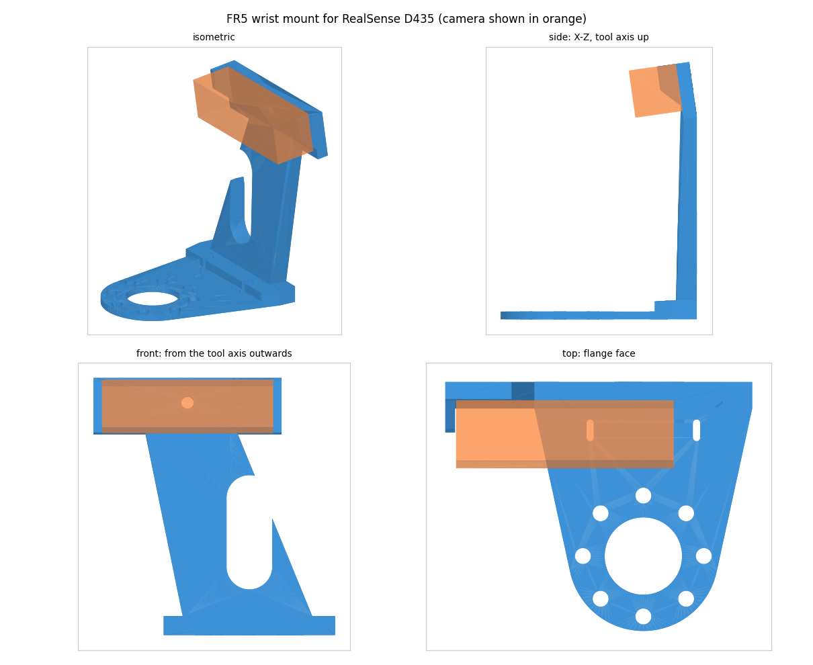
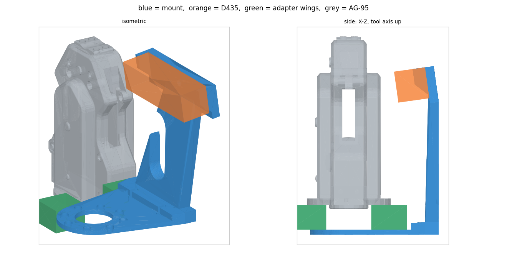

# FR5 손목 D435 마운트 (eye-in-hand, 3D 프린팅)

리그에는 이미 FR5 플랜지와 AG-95 사이에 **금속 어댑터 플레이트**(날개 2개 달린
원판)가 들어 있다. 이 부품은 그 **아래**로 들어간다:

```
로봇 팔(FR5) 툴 플랜지
        │   M6 x 4 (기존 볼트 + 3 mm)
        ├── [ 이 링 3 mm ]  ──→ 카메라 팔이 이 틈에서 옆으로 빠져나감
        │
   기존 어댑터 플레이트 (날개 달린 금속판)
        │   ← 이 결합(어댑터 ↔ AG-95)은 손대지 않는다
      AG-95
```

플랜지 볼트 4개를 3 mm 긴 것으로 바꿔 전부 같이 물린다. FR5 툴 플랜지는 UR과 같은
**ISO 9409-1-50-4-M6** 계열이라(아래 실측) UR5 손목 마운트 관행을 그대로 썼다.




## 두께 설계 — 이게 이 부품의 핵심

어댑터 밑에 깔리는 두께는 **그대로 TCP 오차**가 된다. 그래서:

- **클램프 구간(`clamp_x` 안쪽)은 3 mm**로 끝낸다. 더 두껍게 만들 이유가 없다.
- **강성은 `clamp_x` 바깥에서 회복한다.** 어댑터·그리퍼는 툴축에서 `clamp_x`까지만
  차지하므로, 그 바깥은 위로 자유롭다. 팔은 거기서 14 mm로 올라간다(ramp).
- 얇은 구간이 **19 mm밖에 안 된다**(링 가장자리 31 → `clamp_x` 50). 다만 카메라가
  120 mm 스토크 위로 올라가면서 이 구간이 받는 모멘트가 커져서 3 → **4 mm**로 올렸다
  (위 "카메라 위치" 절의 처짐 계산). 폭도 `arm_w = 90`으로 넓게 잡았다.

## 파일

| 파일 | 내용 |
|---|---|
| `fr5_d435_mount.scad` | **유일한 원본.** 모든 치수가 파라미터 |
| `mount_color.stl` | 본체 — **컬러 이미저 정렬**(`cam_lens_dy=32.5`, 참고본과 동일) |
| `mount_ir.stl` | 본체 — **IR/infra1 이미저 정렬**(`cam_lens_dy=17.5`) |
| `gauge_flange.stl` | **스택 게이지.** 실제 두께(3 mm) + 방향 리브 4개 |
| `gauge_camera.stl` | 카메라 안착 게이지 |
| `check_geometry.py` | STL이 설계 주장(간섭/폭/구멍)을 지키는지 numpy로 검사 |
| `preview.py` | 위 PNG 생성 |
| `Makefile` | `make`, `make check`, `make preview` |

## 출력 전에 — 스택 게이지부터

`gauge_flange.stl`은 **실제 링과 같은 3 mm**다. 그래서 대보는 게 아니라 **진짜로
끼워서** 조립해보는 물건이다. 플랜지 → 게이지 → 기존 어댑터 순으로 볼트를 조이면
한 번에 다 나온다:

1. **볼트원이 Ø50 / M6 4개가 맞는가** (게이지가 안 들어가면 틀린 것).
2. **볼트 길이가 3 mm 더 필요한가** — 기존 볼트로 조여보면 체결 깊이가 얼마나
   모자라는지 바로 안다.
3. **어댑터가 여전히 평평하게 앉는가** — 어댑터 바닥에 스피것/핀이 튀어나와 있으면
   게이지가 들뜬다. 들뜨면 `ring_bore`를 그 스피것 지름 + 0.5로 키운다(최대 42).
4. **핀 위치** — 0/90/180/270°에 Ø6.6을 미리 뚫어놨다. 다른 위치면 `pin_clock`에 추가.
5. **날개 축을 찾는다** — 팔은 날개와 **같은 축**으로 가고(날개 밑을 지나간다),
   게이지의 굵은 리브가 그 기본 팔 방향이다. 리브가 날개와 같은 축에 오게 끼울 수
   없으면 `bolt_clock`을 45↔0으로 바꾼다. 여기서 확인할 핵심은 **날개가 어댑터
   바닥면보다 아래로 내려오지 않는가** — 내려오면 3 mm 링이 그 밑으로 못 들어간다.
6. 날개 반경 46.5 / 높이 20은 실측값이다. 다르면 `wing_r`, `wing_h`를 고치고
   `clamp_x`(= wing_r + 3.5)와 `cam_z`(최하단이 wing 위로 5 mm는 뜨게)를 맞춘다.

`gauge_camera.stl` — D435를 올려서: 벽 간격 90.8 mm에 맞는지, 1/4"-20 구멍이 맞는지,
그리고 **가진 나사로 실제로 조여지는지**. 게이지의 판·카운터보어·머리 밑 살이
본체와 완전히 같은 단면이라, 여기서 조여지면 본체에서도 조여진다.
안 조여지면 `tripod_grip`을 올리고(판 두께가 따라 올라간다), 물림이 얕으면 내린다.

빠른 판정법: 나사를 D435에 손으로 끝까지 돌려 넣고, **머리 밑면부터 카메라 표면까지
남는 길이**를 잰다. 그 값이 `tripod_grip`(6 mm)보다 크면 아직 바닥을 친다는 뜻이니
`tripod_grip`을 그 값 + 1 mm로 올린다.

## 카메라 위치 — 왜 앞으로 뺐나 (2026-09-17 재설계)

첫 실사용 프레임에서 **AG-95가 화면 위쪽 절반 이상(56 %)을 먹고**, 툴축은 화면
아래쪽 66 % 지점에 있었다. 추측이 아니라 확인된 값이다: 그리퍼는 마운트에 고정돼
있으므로 이미지 내 위치가 씬과 무관하게 결정되고, 같은 핀홀 모델로 예측한 그림이
실제 손목 프레임(가운데가 뚫린 두 덩어리)과 일치했다. `preview_view.png` 참고.

원인은 틸트가 아니라 **카메라가 그리퍼 뿌리에 너무 가까이 있었다**는 것이다.
z=44에서는 그리퍼가 시야각을 크게 차지해서, 틸트를 어떻게 줘도 그리퍼를 빼면
작업면이 같이 빠져나간다. 그래서 카메라를 **손가락 쪽으로 밀어올렸다**:

| | 이전 | **현재** |
|---|---|---|
| `cam_z` | 44 | **120** |
| `tilt` | 15° | **8°** |
| 그리퍼 침범 (어댑터 lift 0/10/20 mm) | 54 / 56 / 58 % | **0 / 10 / 17 %** |
| 툴축 위치 @350/400/450 mm (50 %=정중앙) | 63 / 66 / 68 % | **40 / 45 / 48 %** |

카메라 몸체 최상단이 z≈135로, **손가락 끝(≈190)보다 안쪽**이다. 즉 마운트가
테이블에 가장 먼저 닿는 물건이 되는 일은 없다. 옆으로 넓히는 대신 위로 세운
이유가 이것이다.

`ring_t`를 3 → **4 mm**로 올렸다. 카메라가 120 mm 스토크 위에 앉으면서 클램프
구간(31→50 mm)이 받는 모멘트가 커졌기 때문이다. 3 mm면 손목이 수평일 때 자중만으로
0.5° 처져서 0.4 m에서 3.5 mm 지향 오차가 되고, 4 mm면 0.14° / 1.0 mm가 된다.
이 처짐은 손목 자세에 따라 부호가 바뀌므로 핸드아이 캘리브레이션이 흡수하지 못한다.

참고로 받은 `panda_camera_mount_v2.stl`은 카메라 면이 플랜지면에서 40° 기울어져
있는데, 그건 Panda 핸드가 짧아서(플랜지→손가락 끝 ≈107 mm) 40°가 곧 TCP를 겨누는
각이기 때문이다. AG-95는 190 mm라 같은 40°를 쓰면 그리퍼 중간을 겨눈다. 그래서
각도를 베끼는 대신 **겨누는 대상**(작업면)을 같게 맞췄다.

## 렌즈 오프셋 보정 (중요)

**D435의 이미저는 몸체 중심선에 있지 않다.** `realsense2_description/urdf/
_d435.urdf.xacro` 기준으로 폭 방향 오프셋은

| 이미저 | 몸체 중심에서 |
|---|---|
| depth / infra1 (IR 좌) | **+17.5 mm** |
| infra2 (IR 우) | −32.5 mm |
| color | +32.5 mm |

그래서 **몸체를 좌우 대칭으로 물리면 그림이 그만큼 옆으로 밀린다.** 이 마운트는
크래들 자체를 `cam_lens_dy` 만큼 옆으로 밀어서, 몸체가 아니라 **이미저가 툴의
대칭평면(파트 좌표 y=0)에 오도록** 했다.

기본값 **32.5 = 컬러 이미저** 기준이고, 이는 참고본 `panda_camera_mount_v2.stl`을
실측해서 맞춘 값이다:

- 그쪽 카메라 안착면은 Y −62…−4 (중심 **−32.87**), 플랜지 축은 y=0
- 그 면에 **44.6 mm 간격의 구멍 2개**(= D435 전면 M3 패턴)가 중심에 대칭으로 있음
- 즉 카메라 몸체(90 mm)는 −78…+12에 놓이고 안착면이 그 가운데 58 mm를 덮는다
  (양쪽 16 mm씩 오버행 — 대칭)
- 몸체 중심 −32.87 + 컬러 오프셋 32.5 = **−0.4 mm**, 즉 컬러 이미저가 플랜지 축 위

- **IR(infra1) 스트림으로 태그를 검출한다면 `cam_lens_dy = 17.5`** 로 바꾼다.
  둘 중 하나만 축에 올릴 수 있고, 다른 쪽은 15 mm 어긋난다.
- 보정량은 거리와 무관한 일정한 횡방향 편차다. 32.5 mm는 0.3 m에서 6.2°,
  480 px / 69.4° 프레임에서 약 43 px.
- `check_geometry.py`가 고정 구멍 위치를 읽어 이미저가 y=0에 오는지 검사한다.
- 결과적으로 부품이 Y로 비대칭이 된다(−81.9 … +45.0 mm).

## 치수 출처 (무엇이 실측이고 무엇이 가정인가)

| 값 | 출처 |
|---|---|
| 플랜지 OD 63 / 보어 Ø31.5 | **실측** — `meshes/robot/fr5/wrist3_link.STL` 끝면 반지름 31.0…31.5, 내경 15.7 |
| 볼트원 Ø50, M6 4개 | **표준 가정** — 보어/OD가 ISO 9409-1-50-4-M6과 일치하므로 그 규격의 나머지 → 게이지 |
| AG-95 외형 93×67×134.7 | **실측** — `meshes/gripper/ag95/base_link.STL` |
| D435 90×25×25, 바닥 1/4"-20 | **데이터시트 값** → 게이지 |
| 기존 어댑터의 모든 것 (두께·볼트원·스피것·날개·클로킹) | **미확인** → 게이지 |
| D435 전면 M3 2개 | **위치 미확인이라 일부러 안 씀.** 1/4"-20 + 양쪽 벽 구속만 사용 |

## 부품

- **M6 소켓볼트 4개** — 길이 = 지금 것 + **3 mm**. 지금 막대(나사부)가 8 mm이므로
  링을 끼우면 플랜지 체결 깊이가 **8 → 5 mm**로 줄어든다. M6는 최소 6 mm는
  물려야 하니 **반드시 3 mm 이상 긴 것으로 교체**할 것. 다만 플랜지 탭 깊이보다
  길면 바닥을 치니, 조이기 전에 손으로 끝까지 들어가는지 확인.
- **1/4"-20 UNC 나사 1개** — 흔한 삼각대 나사. 나사는 머리 밑 길이에서
  `tripod_grip`(4 mm)을 뺀 만큼 카메라에 들어간다. 즉 3/8"(9.5 mm)면 5.5 mm 물린다.
  - **나사가 카메라 나사부 바닥을 치면 고정이 안 된다.** 그때는 `tripod_grip`을
    올려서(= 머리 밑 살을 더 둬서) 덜 들어가게 만든다. 반대로 물림이 너무 얕으면
    내린다. 인쇄 없이 당장 해결하려면 머리 밑에 와셔를 끼우면 같은 효과다.
- 케이블 타이 2개 (폭 ≤3 mm).

## 프린트 설정

- **PETG 또는 ASA.** PLA 비권장 — 볼트 예압이 계속 걸려 크리프로 풀린다.
- 노즐 0.4 / 레이어 0.2 / 외벽 4겹 이상 / 인필 40% 이상.
- **서포트 불필요** (이 방향에서 45° 넘는 오버행이 없게 설계).
- **엘리펀트 풋 보정 0.15~0.2 mm.** 플랜지 접촉면이 평평해야 한다. 3 mm 링에서는
  첫 레이어 퍼짐이 곧 면압 불균일이다. 출력 후 모서리 버는 칼로 훑을 것.
- 소재량 98.9 cm³ (PETG 100%면 126 g, 일반 설정 ~88 g). IR본은 96.9 cm³ / ~86 g. 스토크가 길어진 몫이다.
  스토크 가운데 창(`window_d`)으로 덜어낸 몫은 약 14 cm³다. 카메라 ~72 g(데이터시트) 별도.

## 조립

1. 스택 게이지로 위 6항목 확인.
2. **어댑터–AG-95 결합은 건드리지 않는다.** 푸는 것은 어댑터를 로봇 플랜지에
   물고 있는 M6 4개뿐이고, 어댑터+그리퍼는 한 덩어리로 내렸다가 그대로 다시 얹는다.
   (합쳐서 1 kg 가까이 되니 받친 채로 풀 것.)
3. 링을 로봇 플랜지에 얹고 — **팔이 날개와 같은 축**(손가락 열림축과 수직)으로
   오게 — 그 위에 어댑터+그리퍼 덩어리를 그대로 얹어 3 mm 긴 볼트로 대각선 순서
   체결. 팔의 평평한 구간이 날개 밑을 지나간다. **토크는 금속-금속 규정값보다 낮게**
   (하중경로에 플라스틱 3 mm가 들어 있다). **몇 시간 운전 후 재토크.**
4. D435를 벽 사이에 넣고 1/4"-20으로 고정. 슬롯이 ±3 mm 전후 조정용.
5. USB-C 케이블을 팔의 슬롯에 타이로 고정. 관절 6 회전 범위만큼 여유를 줄 것.

## 로봇 쪽에 미치는 영향

- **TCP가 4 mm 멀어진다** (`ring_t`).
  - `urdf/robot/fr5_ag95.urdf`의 `gripper_base_joint` origin → `xyz="0 0 0.004"`.
    `grasp_frame`은 플랜지에서 170 → **174 mm**.
  - 실기 펜던트 TCP도 같이. 안 바꾸면 모든 파지가 3 mm 얕아진다.
  - ⚠ 참고: 현재 URDF는 **기존 어댑터 두께 자체를 모델링하지 않는다**
    (`gripper_base_joint` origin = 0). 즉 지금도 어댑터 두께만큼 어긋나 있을 수
    있다. 어댑터 두께를 재서 같이 반영하는 게 맞다.
- **손목 충돌 엔벨로프가 커진다**: 툴축에서 최대 반경 **72.0 mm**, 폭 −66.9…+45.0 mm
  (렌즈 오프셋 때문에 좌우 비대칭: **−81.9 … +45.0 mm**),
  플랜지면 위로 **135.1 mm**(카메라 상단). 그리퍼 손가락 끝(≈190)보다는 안쪽이지만,
  옆으로 74 mm 튀어나온 판이 통째로 서 있는 형상이라 플래너에 반드시 반영해야 한다. 플래너를 돌리기 전에 `mount.stl`을 tool0의 collision mesh로
  넣거나 curobo sphere set에 반영할 것.
- 손목 부하 +160 g 정도(부품 ~88 g + 카메라 ~72 g), 툴축에서 ~50 mm 편심.
  5 kg 가반에는 무의미하지만 펜던트 payload/무게중심은 갱신하는 편이 낫다.

## 카메라가 실제로 보는 것

파트 좌표계(+Z = 툴축, +X = 팔 방향), `check_geometry.py`가 출력하는 값:

- 카메라 몸체 중심: 플랜지면에서 **(x, z) = (50.07, 44.0) mm**
- 광축이 툴축과 만나는 지점: 플랜지 앞 **231 mm**
- 그리퍼 그림자 경계: 플랜지 앞 200 / 300 / 400 mm 평면에서 x = **27 / 13 / −2 mm**
  안쪽이 가려짐 → **툴축 자체는 플랜지 앞 388 mm부터 보인다.**
- 이게 불편하면 `cam_z`를 더 올리면 된다(타워가 높아지고 캔틸레버가 길어진다):
  44 → 388 mm, 55 → 365 mm, 65 → 345 mm. 44보다 낮출 수는 없다(날개).
- ⚠ 위 두 값은 그리퍼 몸통 꼭대기 높이에 의존하는데, **어댑터가 그리퍼를 얼마나
  띄우는지는 실측 안 된 값**이다. 날개 높이 20 mm를 상한으로 써서 계산했으므로
  실제로는 이보다 나을 가능성이 크다. 어댑터 두께를 재면 확정된다.
- 즉 **파지 순간의 TCP는 그리퍼에 가려 안 보인다.** 낮고 단단한 마운트를 택한
  대가다. 태그를 볼 때는 대상이 툴축 위에 있을 필요가 없으니(팔을 움직여 FOV에
  넣으면 된다) 실사용에는 영향이 적지만, "툴축 정면"만 보는 view pose를 쓴다면
  플랜지에서 0.44 m 이상 띄워야 한다.
- 뒤판·양쪽 벽은 **렌즈면보다 앞으로 나가지 않는다**(`check_geometry.py`가 검사).
  FOV를 깎지 않는다는 뜻.
- depth는 D435 최소 측정거리(Min-Z)보다 가까우면 안 나온다. view pose를 그 바깥에.

`tilt`를 바꾸면 위 숫자가 전부 바뀐다. 바꾼 뒤 `make check`로 다시 뽑을 것.

### 카메라 프레임 (wrist3 기준)

URDF의 `wrist3-flange` + `flange-tool0` 두 회전은 정확히 상쇄된다. 즉

```
tool0 = wrist3_link 를 +Z 로 100 mm 옮긴 것, 회전 없음
```

마운트는 팔이 tool0의 **+Y**(= 날개 축, 손가락 열림축과 수직)로 가게 끼운다.
그러면 CAD상 공칭값은:

| 프레임 | 부모 | xyz (m) | rpy (rad) |
|---|---|---|---|
| `camera_bottom_screw_frame` (1/4"-20) — **컬러본** | `tool0` | `0.0325  0.06276  0.12174` | `3.1416  -1.4312  -1.5708` |
| 〃 — **IR본** | `tool0` | `0.0175  0.06276  0.12174` | `3.1416  -1.4312  -1.5708` |
| 〃 — 컬러본 | `wrist3_link` | `0.0325  0.06276  0.22174` | `3.1416  -1.4312  -1.5708` |
| 정렬된 이미저의 광학 프레임 | `wrist3_link` | `0  0.05038  0.22000` | `0.1396  0  0` |

광학 프레임은 **wrist3를 X축으로 8° 돌린 것뿐**이다(= `tilt`). 광축은
wrist3 좌표로 `(0, −0.1392, 0.9903)`, 즉 툴축에서 안쪽으로 8°.
영상의 "아래"가 +Y(카메라가 달린 쪽)를 향하므로 **그리퍼는 화면 위쪽**에 찍힌다.

나사 구멍이 x=32.5 mm(IR본은 17.5)에 있는 것이 렌즈 오프셋 보정의 결과다. **이미저 프레임은
정확히 wrist3의 XZ 평면 위(y 성분 0)**에 온다 — 그게 이 보정의 목적이다.
클로킹을 다르게 끼우면 Z축 90°씩 돌면 된다.

### URDF 조각 (핸드아이 캘리브레이션 **전에는 넣지 말 것**)

`camera_bottom_screw_frame`은 realsense2_description의 D435 xacro가 붙는 지점이다.
거기에 붙이면 컬러/뎁스 광학 프레임은 공식 xacro가 알아서 만들어준다 — RGB 이미저가
몸체 중심에서 벗어나 있는 오프셋까지 포함해서. 위 표의 "광학 프레임(근사)"는
그 오프셋이 빠진 값이니 급할 때만 쓸 것.

```xml
<!-- nominal from CAD: replace with the hand-eye result -->
<joint name="d435_mount_joint" type="fixed">
  <parent link="tool0"/>
  <child  link="camera_bottom_screw_frame"/>
  <origin xyz="0.0325 0.06276 0.12174" rpy="3.1416 -1.4312 -1.5708"/>
</joint>
```

공칭값의 한계: 볼트 클리어런스(Ø6.6/M6)만으로 ±0.3 mm, 인쇄 수축·조립 기울기까지
더하면 그 이상이다. **실제 값은 핸드아이 캘리브레이션이 정한다.**

## 파라미터

| 파라미터 | 기본 | 언제 건드리나 |
|---|---|---|
| `ring_t` | 4 | TCP 오차. 스토크가 길어서 3보다 아래로는 권하지 않음 |
| `clamp_x` | 50 | 날개 반경 46.5 + 3.5 |
| `wing_r`/`wing_h` | 46.5 / 20 | 어댑터 날개 실측값. 바뀌면 `clamp_x`·`cam_z`도 |
| `ring_bore` | 32 | 어댑터 바닥 스피것이 더 크면 키운다 (최대 42) |
| `bolt_clock` | 45 | 게이지에서 팔 방향이 안 맞으면 0 |
| `cam_clear` | 38 | 좁은 쪽 기준 33.5 + 4.5 |
| `cam_z` | 120 | 그리퍼 침범량을 정하는 값. 130으로 올리면 0/0/10 %가 된다 |
| `tilt` | 8° | 툴축을 화면 중앙에 두는 값. 키우면 툴축이 아래로 내려온다 |
| `cam_fit` | 0.8 | 게이지에서 카메라가 뻑뻑/헐거울 때 |
| `tripod_grip` | 4 | 나사 머리 밑 살 두께(판 두께 = 이 값 + 3). 나사가 바닥 치면 ↑ |
| `tripod_travel` | 0 | 0 = 구멍. 슬롯을 주면 그만큼 카메라가 흔들린다 |
| `window_d` | 24 | 스토크 창 폭. 키우면 가벼워지고 줄이면 단단해진다. 0 = 막힘 |
| `wall_len` | 12.5 | 양쪽 벽의 전체 높이 구간 길이. 줄이면 커넥터가 더 열린다 |
| `cam_lens_dy` | 32.5 | **검출에 쓰는 스트림 기준.** 컬러=32.5(참고본과 동일), IR=17.5 |

```bash
make && make check && make preview
```
